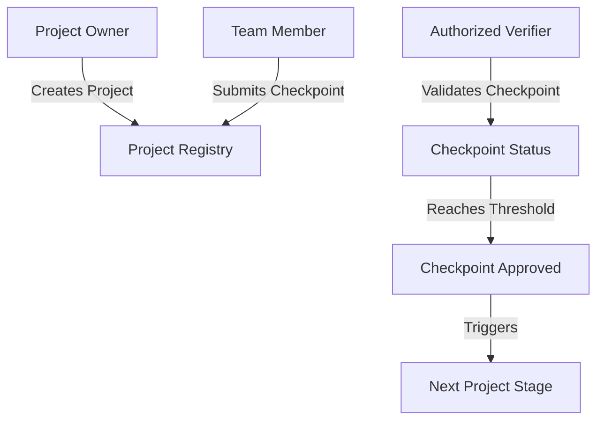

# Continuous Checkpoint Authorizer

A decentralized system for transparent and secure progress tracking across complex, long-term projects. The Continuous Checkpoint Authorizer enables dynamic verification of project milestones through a robust, blockchain-powered mechanism.

## Overview

Continuous Checkpoint Authorizer provides:
- Flexible project milestone tracking
- Decentralized progress verification
- Multi-party checkpoint validation
- Transparent evidence submission
- Role-based access control

## Architecture



The system uses multiple data maps to track:
- Project registrations
- Checkpoint submissions
- User authorization levels
- Verification progress
- Evidence tracking

## Contract Documentation

### Main Contract: checkpoint-authorizer

Core functionalities:

1. **Project Management**
   - Create new projects
   - Define project-specific authorization
   - Track total project checkpoints

2. **Checkpoint Handling**
   - Submit progress checkpoints
   - Provide evidence references
   - Multi-party verification
   - Dynamic status updates

3. **Access Control**
   - Role-based checkpoint submission
   - Configurable verification thresholds
   - Prevent duplicate verifications

## Getting Started

### Prerequisites
- Clarinet installation
- Stacks wallet
- Basic understanding of project tracking

### Basic Usage

**1. Creating a Project**
```clarity
(contract-call? .checkpoint-authorizer create-project 
    "Software Development Project"
)
```

**2. Submitting a Checkpoint**
```clarity
(contract-call? .checkpoint-authorizer submit-checkpoint 
    u1 ;; project-id
    "Completed backend authentication module" ;; description
    "https://github.com/project/commits/auth" ;; evidence URI
)
```

**3. Verifying a Checkpoint**
```clarity
(contract-call? .checkpoint-authorizer verify-checkpoint 
    u1 ;; project-id
    u1 ;; checkpoint-id
)
```

## Function Reference

### Project Functions
- `create-project`: Initialize a new project
- `submit-checkpoint`: Add progress checkpoint
- `verify-checkpoint`: Validate project milestone

### Authorization Management
- Configurable submission rights
- Configurable verification permissions

## Development

### Testing
Run tests using Clarinet:
```bash
clarinet test
```

### Security Considerations

1. **Verification Integrity**
   - Multi-party checkpoint validation
   - Prevents single-point manipulation
   - Configurable verification thresholds

2. **Access Control**
   - Granular project-level permissions
   - Prevents unauthorized submissions
   - Tracks all verification attempts

3. **Transparency**
   - Immutable checkpoint evidence references
   - Complete audit trail
   - Status tracking for each milestone

### Important Limitations
- Maximum 5 verifiers per checkpoint
- Verification threshold is 2 approvals
- Evidence stored via URI, not on-chain
- Project owners manage authorization